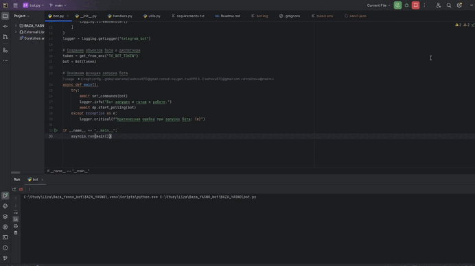

# Telegram Bot для базы отдыха ЯСНО

Этот бот позволяет пользователям регистрироваться, проверять свою регистрацию и получать прогноз погоды.

## Установка

1. Клонируйте репозиторий:
   ```bash
   git clone https://github.com/yourusername/yasno-bot.git
2. Установите зависимости:
   ```
   pip install -r requirements.txt
3. Создайте файл .env в корневой директории проекта и добавьте следующие переменные:
   ```
   TG_BOT_TOKEN=your_telegram_bot_token
   SHEET_ID=your_google_sheet_id
   OPENWEATHER_API_KEY=your_openweathermap_api_key
4. Запустите бота:
   ```
   python bot.py
## Команды бота

- `/start` — Начать общение.  
- `/help` — Список доступных команд.  
- `/register` — Регистрация пользователя.  
- `/check` — Проверка регистрации.  
- `/weather` — Получение прогноза погоды.  

---

## Авторы

- **Шихова Елизавета Павловна**  
- **Номер ИСУ:** 470120
-  **GitHub:** [shizalihova](https://github.com/shizalihova)

---

## Видео с демонстрацией работы бота

